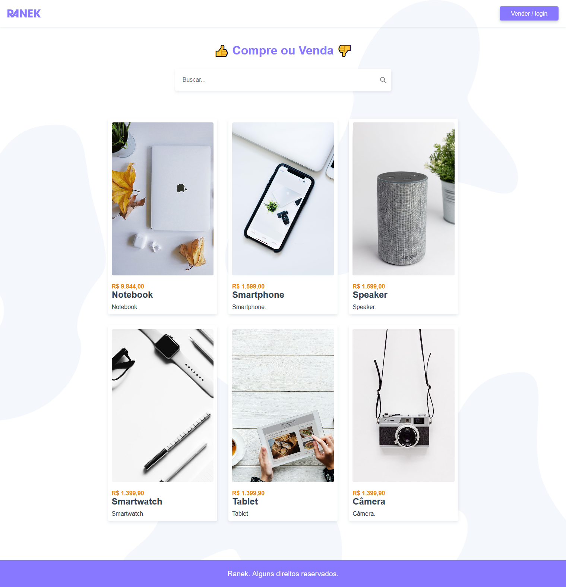

# Ranek

## Descrição

Um site de compra e venda de produtos.

## Tecnologia Utilizada

O projeto foi implementado usando o framework [Vue.js](https://vuejs.org/index.html).

## Back-end

A API ([Ranek-API](https://github.com/lucas-salles/ranek-api)) utilizada foi feita usando o framework [Laravel](https://laravel.com/).

## Project setup

```
npm install
```

### Compiles and hot-reloads for development

```
npm run serve
```

### Compiles and minifies for production

```
npm run build
```

### Run your tests

```
npm run test
```

### Lints and fixes files

```
npm run lint
```

### Customize configuration

See [Configuration Reference](https://cli.vuejs.org/config/).


